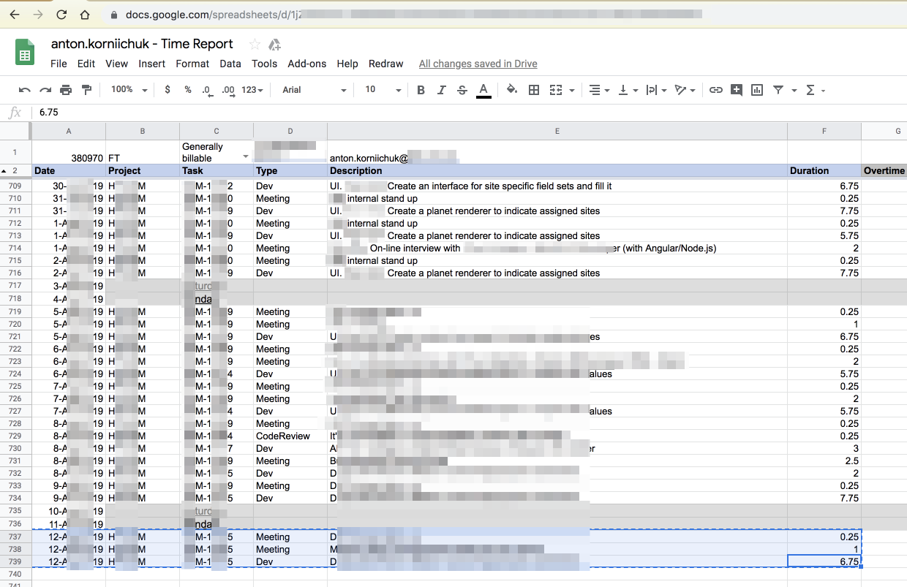
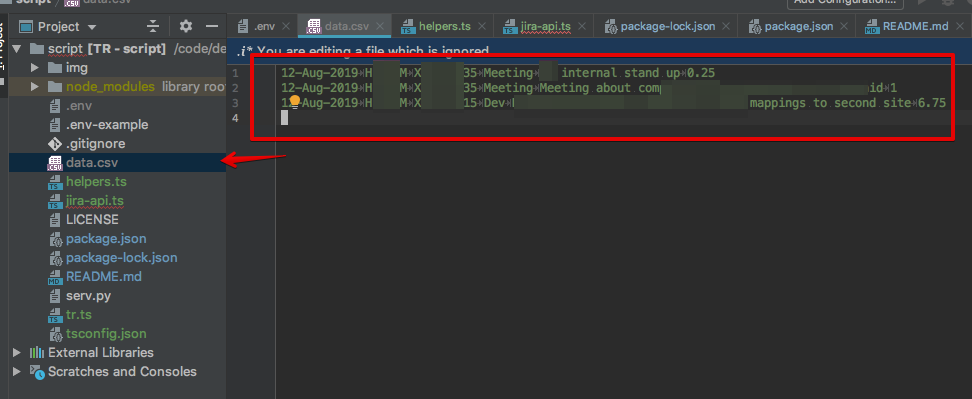

# dp-tr

### Requirements

- NodeJS & NPM

### Installation

1. `git clone git@github.com:korniychuk/dp-tr.git `
2. `cd dp-rt && npm i`
3. Create `/.env` file with next variables:
   ```dotenv
   JIRA_HOST=...JIRA URL...
   JIRA_LOGIN=anton.korniichuk
   JIRA_PASSWORD=...YOUR PASSWORD...
   JIRA_USER_NAME=anton.korniichuk
   JIRA_USER_NAME_HUMAN=Anton Korniichuk
   EXCLUDE_PROJECTS=Excluded-1,IRP
   ```

### Using

1. Create `/data.csv` and fill it with time report
   
   
2. `npm start`
